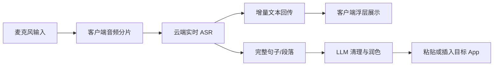
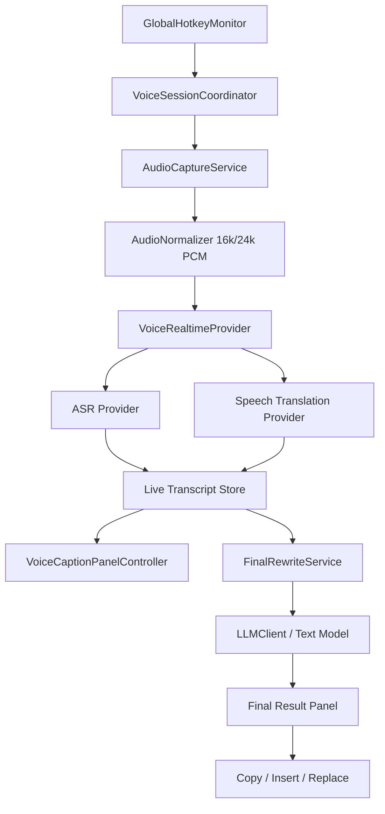

# NextUp 语音输入与同传工具第一阶段调研文档

更新时间：2026-06-18  
阶段目标：基于现有 Mac 应用 NexHub/NextUp 的能力，规划一个可落地的 Typeless 类产品，但第一版只聚焦两个核心功能：实时转写与实时翻译。

## 1. 背景介绍

### 1.1 目标产品

这次要做的不是完整复刻 Typeless，而是做一个更聚焦、更适合个人开发落地的 Mac 工具。临时命名为 **NextUp Voice**。

核心功能只有两个：

1. **转写**
   - 用户说话时实时出字。
   - 用户说完后，对整段内容做一次最终润色。
   - 支持中文、英文。

2. **翻译 / 同声传译**
   - 用户说话时实时输出目标语言文字。
   - 用户说完后，对完整翻译稿做一次整体改写，让它更自然。
   - 支持中文到英文、英文到中文，后续再扩展更多语言。

最重要的产品指标是 **低延迟**。转写质量第一版可以先接受中上水平，但速度必须优先。

### 1.2 Typeless 给我们的启发

Typeless 当前公开资料显示，它更像是一个云端 AI 语音输入工具：用户通过语音输入，服务端做转写、清理、润色和格式化。它的公开功能包括：

- AI 语音输入、自动删除口头禅和重复词。
- 自动修正错别字、标点、大小写和格式。
- 支持 100+ 语言。
- 支持个人词典、应用级语气、翻译、对选中文本发起语音编辑。
- macOS、Windows、iOS、Android 多端覆盖。

这说明 Typeless 的方向不是单纯 ASR，而是“**语音输入 + AI 改写 + 跨应用输入体验**”。我们第一版可以更小：只做 Mac 端、只做转写和同传，把体验做快做稳。

Typeless 详细调研已整理在：[typeless_research_report.md](./typeless_research_report.md)。

### 1.3 为什么适合从 NexHub/NextUp 复用

NexHub 已经是一个 Swift macOS 应用，且本来就是围绕“跨 App 文本选择 + AI 操作”做的。它已有很多和新工具重叠的基础设施：

- macOS 菜单栏常驻应用。
- 设置窗口和多 Tab 配置页。
- Accessibility 权限管理。
- 全局快捷键监听。
- 浮动工具条和结果面板。
- AI Provider / Model / API Key 设置。
- Keychain 安全存储 API Key。
- 本地 Gateway。
- 打包、签名、DMG、Sparkle 更新相关脚本。

所以第一阶段判断是：**不要从零开始新建 App。应该以 NexHub 为基础，拆出或新增 Voice 模块。**

## 2. 调研情况

### 2.1 NexHub 仓库研究结论

我没有改动你本机已有的 NexHub 仓库。为了避免影响已有工作，我只在当前工作区克隆了一份只读研究副本：

```text
/Users/nefish/Documents/Codex/2026-06-18/typeless-typeless/work/NexHub
```

仓库基本情况：

- 技术栈：Swift Package + AppKit。
- 平台：macOS 13+。
- 入口：`NexHubHost` executable target。
- 依赖：Sparkle binary target。
- 运行脚本：`./scripts/dev_run.sh`。
- 检查脚本：`./scripts/checks.sh`。
- 打包脚本：`./scripts/build_app.sh`、`./scripts/package_share.sh`、`./scripts/release_one_click.sh`。

可复用模块如下：

| 能力 | NexHub 现有位置 | 复用方式 |
| --- | --- | --- |
| 权限管理 | `Sources/NexHub/Services/PermissionManager.swift` | 保留 Accessibility、Input Monitoring、Screen Recording 等逻辑；新增 Microphone 权限 |
| 全局快捷键 | `Sources/NexHub/Services/GlobalHotkeyMonitor.swift` | 用作按住说话、开始/停止录音、切换模式的快捷键基础 |
| AI 设置 | `Sources/NexHub/UI/SettingsWindowController.swift`、`SettingsConfigurationCoordinators.swift` | 扩展成语音模型、同传模型、润色模型三组设置 |
| API Key 安全存储 | `Sources/NexHub/App/AppSettings.swift`、`SecretsStore` | 沿用 Keychain 机制，不把密钥放到 UserDefaults |
| 文本 LLM 客户端 | `Sources/NexHub/Services/LLMClient.swift` | 可直接用于最终润色、最终翻译稿改写；不适合实时音频 |
| 托管 AI 配置 | `Sources/NexHub/App/ManagedAIConfigurationService.swift` | 后续如果要做订阅制/额度制，可复用思路 |
| 浮层 UI | Result Panel / Floating Toolbar / SharedStreamingUI | 改造成实时字幕窗、结果确认窗 |
| 打包发布 | `scripts/` | 第一版本地分发和 DMG 打包可直接复用 |

需要新增的核心模块：

| 新模块 | 作用 |
| --- | --- |
| `MicrophonePermission` | 麦克风权限检查、申请、跳转系统设置 |
| `AudioCaptureService` | 采集麦克风音频，统一转成 16k/24k mono PCM |
| `VoiceRealtimeProvider` | 统一不同云厂商 WebSocket/Realtime API |
| `TranscriptionSession` | 实时转写会话，处理 partial/final 文本 |
| `TranslationSession` | 实时同传会话，处理源语言、目标语言和翻译增量 |
| `FinalRewriteService` | 说完后调用文本模型整体润色 |
| `VoiceCaptionPanelController` | 实时字幕/同传输出 UI |
| `VoiceSettingsCoordinator` | 语音模型、同传模型、端侧/云端切换配置 |

### 2.2 Typeless 技术逻辑推断

Typeless 官方隐私与数据控制页显示，它会把用户语音/文本发送到云端模型供应商处理，并提到使用 OpenAI 等领先 LLM 供应商。结合产品形态，技术链路大概率是：



它的优势不是某一个模型，而是完整体验：

- 启动快。
- 在任意 App 内可用。
- 实时反馈。
- 最终输出比原始语音更像可发送文本。
- 有个人词典和应用场景风格。

我们要做得更好，第一版可以优先在以下点超过它：

- 明确提供“极速模式”和“高质量模式”。
- 设置里可切换国内厂商、OpenAI、端侧模型。
- 给用户展示实时延迟与模型状态，避免黑盒。
- 支持“实时同传 + 最终改写”这种更明确的双阶段体验。
- 后续支持本地模型作为隐私模式或弱网兜底。

### 2.3 云端还是端侧

结论：**第一版主链路建议云端，端侧先预留接口。**

原因很直接：

- 你的第一优先级是低延迟。
- 云端实时 ASR/同传 API 已经是成熟商品，WebSocket 能直接返回增量结果。
- 端侧模型虽然省网络往返，但在 Mac App 中要做好音频切片、推理调度、模型下载、不同芯片性能适配，第一版复杂度会明显上升。
- 端侧 ASR 可以做，但更适合作为第二阶段能力。

端侧可预留的模型方向：

| 类型 | 可选方案 | 适合用途 | 第一版建议 |
| --- | --- | --- | --- |
| 本地 ASR | whisper.cpp tiny/base/small | 离线转写、隐私模式 | 预留，不做主链路 |
| 本地 ASR | Moonshine tiny/base | 低延迟英文转写探索 | 技术 Spike |
| 本地 ASR | SenseVoice Small | 中文识别探索 | 技术 Spike |
| 本地 LLM | Qwen/DeepSeek 蒸馏小模型、Phi、Llama 小模型 | 最终润色 | 不作为默认 |
| 本地推理框架 | MLX / llama.cpp / Ollama | Mac 本地模型运行 | 设置里预留本地 endpoint |

建议在设置里先预留：

- 本地 ASR HTTP/WebSocket Endpoint。
- 本地 LLM Base URL。
- 本地服务端口。
- 模型文件路径。
- 是否启用本地兜底。

推荐默认本地端口规划：

| 服务 | 默认端口 | 说明 |
| --- | --- | --- |
| NexHub 原有 Gateway | `127.0.0.1:8787` | 保持不动，避免影响旧功能 |
| Voice Gateway | `127.0.0.1:8791` | 新工具统一转发语音/模型请求 |
| Local ASR | `127.0.0.1:8792` | 预留给 whisper.cpp / Moonshine / SenseVoice |
| Local LLM | `127.0.0.1:8793` | 预留给 Ollama / llama.cpp / MLX server |

### 2.4 国内厂商与模型调研

#### DeepSeek

DeepSeek 适合做 **最终润色、最终改写、文本翻译**，不适合做实时语音转写。

优点：

- OpenAI/Anthropic 兼容格式，NexHub 当前 `LLMClient` 已经支持 `deepseek`。
- 价格很低。官方价格页显示 `deepseek-chat` 输入 cache miss 为 `$0.14 / 1M tokens`，输出 `$0.28 / 1M tokens`；`deepseek-reasoner` 更贵且更慢。
- 中文文本能力强，适合把口语稿整理成自然文本。

限制：

- 它不是 ASR 服务。
- 不适合实时同传主链路，因为 reasoning 模型延迟较高。

建议：

- 默认最终润色模型：`deepseek-chat`。
- 不建议第一版默认用：`deepseek-reasoner`。
- 设置里保留 DeepSeek Base URL、API Key、Model。

来源：[DeepSeek API Pricing](https://api-docs.deepseek.com/quick_start/pricing)、[DeepSeek API Docs](https://api-docs.deepseek.com/)。

#### 阿里云 / 通义 / DashScope

阿里适合做 **实时转写**，文本润色也可以用 Qwen。

可用能力：

- 阿里百炼语音识别支持实时 WebSocket。
- 推荐模型里有 `qwen3-asr-flash-realtime`、`fun-asr-realtime`、`qwen3.5-omni-plus-realtime`。
- `fun-asr-realtime` 支持中、英、日及方言，音频时长无限制。
- `qwen3-asr-flash-realtime` 支持多语种及方言，WebSocket 实时。
- 阿里智能语音交互在线版实时语音识别后付费公开价格为 3.50 元/小时起，量大后更低；但百炼具体模型价格要以开通页为准。

建议：

- 国内 ASR 候选一：`qwen3-asr-flash-realtime`。
- 低成本 ASR 候选：`fun-asr-realtime`。
- 最终润色候选：Qwen Flash/Plus 系列。
- 第一版可以接入阿里 ASR，但同传可先走“ASR + DeepSeek/Qwen 文本流式翻译”的级联方案。

来源：[阿里百炼语音识别模型](https://help.aliyun.com/zh/model-studio/asr-model/)、[阿里实时语音识别用户指南](https://help.aliyun.com/zh/model-studio/real-time-speech-recognition-user-guide)、[阿里智能语音交互计费](https://help.aliyun.com/zh/isi/product-overview/billing-10)。

#### 腾讯云

腾讯适合做 **实时转写 + 实时语音翻译**，是第一版国内方案里很值得优先验证的选择。

可用能力：

- 实时语音识别提供 WebSocket 接口。
- 计费页显示实时语音识别大模型版后付费 4.80 元/小时起。
- 大模型实时语音翻译后付费 5 元/小时起。
- 这对同传功能很有价值，因为可以避免我们自己拼“ASR + 文本翻译”的级联延迟。

建议：

- 国内同传首选验证：腾讯大模型实时语音翻译。
- 国内 ASR 首选验证之一：腾讯实时语音识别大模型版。
- 最终润色可仍然交给 DeepSeek/Qwen/豆包，不一定用腾讯混元。

来源：[腾讯云实时语音识别 WebSocket](https://cloud.tencent.com/document/product/1093/48982)、[腾讯云语音识别计费](https://cloud.tencent.com/document/product/1093/35686)。

#### 百度智能云

百度适合做 **实时转写 + 实时语音翻译备选**。

可用能力：

- 实时语音识别采用 WebSocket，边上传音频边获取识别结果。
- 实时语音翻译支持中英日韩法西泰俄等 45 个语种，WebSocket，实时输出识别结果和翻译结果。
- 计费支持小时包预付费和调用时长后付费。

建议：

- 作为国内同传第二候选。
- 如果腾讯同传接入或质量不理想，可以快速替换验证百度。

来源：[百度实时语音识别 WebSocket](https://cloud.baidu.com/doc/SPEECH/s/jlbxejt2i)、[百度实时语音翻译](https://cloud.baidu.com/product/mt/realtime_speech_trans)、[百度语音识别计费](https://ai.baidu.com/ai-doc/SPEECH/Tldjm0i4c)。

#### 科大讯飞

讯飞适合做 **中文识别质量验证**。

可用能力：

- 实时语音听写支持中文普通话、英文、多语种和方言，边说边返回。
- 实时语音转写是成熟产品，价格多为套餐制。

建议：

- 如果第一版发现中文识别质量是主要瓶颈，可以把讯飞作为专项对照。
- 但讯飞 API 体系通常会涉及 AppID、APISecret、APIKey 等多字段鉴权，接入复杂度略高于 OpenAI 兼容文本模型。

来源：[讯飞实时语音听写](https://www.xfyun.cn/services/voicedictation)、[讯飞实时语音转写](https://www.xfyun.cn/services/rtasr)。

#### 火山引擎 / 豆包

火山适合做 **ASR 候选、文本模型候选、实时语音大模型探索**。

可用能力：

- 豆包语音提供大模型流式语音识别，WebSocket 接入。
- 火山机器翻译产品包含实时语音翻译。
- 豆包文本模型价格较低，产品页显示 Doubao-Seed-2.0-lite 为 0.6 元起/百万输入 tokens、3.6 元起/百万输出 tokens。

建议：

- 文本润色候选：`doubao-seed-2.0-lite`。
- ASR 候选：豆包大模型流式语音识别。
- 端到端实时语音大模型更偏语音对话，不一定适合我们的“只要文字同传”第一版，可放到第二阶段探索。

来源：[火山大模型流式语音识别 API](https://www.volcengine.com/docs/6561/1354869)、[火山机器翻译计费](https://www.volcengine.com/docs/4640/68515)、[豆包大模型产品页](https://www.volcengine.com/product/doubao)。

### 2.5 推荐模型组合

#### 推荐方案 A：国内优先、成本优先

这是我建议第一阶段落地时优先验证的方案。

| 功能 | 推荐服务 | 原因 |
| --- | --- | --- |
| 实时转写 | 腾讯云实时语音识别大模型版，或阿里 `qwen3-asr-flash-realtime` | 都是 WebSocket 实时，国内网络稳定 |
| 实时同传 | 腾讯云大模型实时语音翻译 | 价格公开、直接支持语音翻译，链路更短 |
| 最终润色 | DeepSeek `deepseek-chat` | 成本极低，中文文本能力强 |
| 最终翻译稿改写 | DeepSeek `deepseek-chat` / Qwen Flash / 豆包 Lite | 低成本，速度够快 |
| 端侧兜底 | 暂不默认启用 | 先预留接口，第二阶段验证 |

优点：

- 成本低。
- 国内访问稳定。
- 同传不需要自己拼多段链路。
- NexHub 已经有 DeepSeek 文本模型设置基础。

风险：

- 国内 ASR/同传 API 的鉴权方式各不相同，需要逐个适配。
- 实时翻译质量必须用真实中英语音样本验证。
- Provider 控制台开通、实名认证、额度和并发限制需要实际账号确认。

#### 推荐方案 B：体验优先、开发最快

| 功能 | 推荐服务 |
| --- | --- |
| 实时转写 | OpenAI `gpt-realtime-whisper` |
| 实时同传 | OpenAI `gpt-realtime-translate` |
| 最终润色 | DeepSeek `deepseek-chat` 或 OpenAI mini |

优点：

- Realtime API 文档完整，开发速度快。
- 转写和翻译都是专用实时模型。
- 适合先证明产品体验。

风险：

- 成本比国内部分 ASR 更高。
- 国内网络稳定性、账号和支付不一定是最优。

来源：[OpenAI Realtime Transcription](https://developers.openai.com/api/docs/guides/realtime-transcription)、[OpenAI Realtime Translation](https://developers.openai.com/api/docs/guides/realtime-translation)。

#### 推荐方案 C：端侧隐私模式

| 功能 | 推荐服务 |
| --- | --- |
| 实时转写 | whisper.cpp small/base 或 SenseVoice Small |
| 实时同传 | 本地 ASR + 云端文本翻译 |
| 最终润色 | 本地小 LLM 或云端 DeepSeek |

优点：

- 隐私更好。
- 弱网可用。

风险：

- 第一版开发复杂度高。
- 不同 Mac 芯片表现差异大。
- 实时体验未必比云端快。

建议：第二阶段做 Benchmark，不要放进第一版主链路。

## 3. 产品与技术方案

### 3.1 第一版产品形态

第一版不要做大而全，建议只做一个小而强的 Mac 菜单栏工具：

- 菜单栏常驻。
- 一个全局快捷键开始/停止说话。
- 一个小型实时字幕窗展示转写或翻译。
- 说完后自动生成最终稿。
- 最终稿可复制、插入当前光标、替换选区。
- 设置页可配置服务商、模型、API Key、语言方向、模式。

推荐两个模式：

1. **转写模式**
   - 输入：中文/英文语音。
   - 实时输出：原语言文字。
   - 结束输出：润色后的原语言文本。

2. **同传模式**
   - 输入：中文或英文语音。
   - 实时输出：目标语言文字。
   - 结束输出：更自然的目标语言文本。

### 3.2 设置页需要预留的接口

建议新增一个「语音」Tab，里面分成四组。

#### 实时转写

- Provider：OpenAI / 阿里 / 腾讯 / 百度 / 讯飞 / 火山 / Local。
- Model：如 `qwen3-asr-flash-realtime`、`fun-asr-realtime`、腾讯实时 ASR 大模型版等。
- Endpoint / WebSocket URL。
- API Key / Secret / AppID。
- 采样率：16k / 24k。
- 语言：自动 / 中文 / 英文。
- 热词 / 个人词典。

#### 实时同传

- Provider：OpenAI / 腾讯 / 百度 / 火山 / 级联方案。
- Source Language：自动 / 中文 / 英文。
- Target Language：中文 / 英文。
- Model / Endpoint。
- 是否显示原文。
- 是否启用中间结果。

#### 最终润色

- Provider：DeepSeek / Qwen / 豆包 / OpenAI / Gemini / Local。
- Model：默认 `deepseek-chat`。
- Base URL。
- API Key。
- Prompt 模板：
  - 转写润色模板。
  - 翻译稿改写模板。
  - 应用场景模板。

#### 本地模型

- Local ASR Endpoint：默认 `http://127.0.0.1:8792`。
- Local LLM Endpoint：默认 `http://127.0.0.1:8793`。
- 模型文件路径。
- 是否启用本地兜底。
- 网络失败时是否自动切换。

### 3.3 技术架构

推荐架构如下：



关键原则：

- 音频采集、实时服务商、文本润色要分层。
- 不把某一个厂商写死在 UI 或业务逻辑里。
- 实时服务使用统一事件格式：
  - `sessionStarted`
  - `partialTranscript`
  - `finalTranscript`
  - `partialTranslation`
  - `finalTranslation`
  - `latencyUpdated`
  - `sessionEnded`
  - `error`
- 结束后再调用文本 LLM 做最终清理，避免实时阶段承担太多复杂工作。

### 3.4 延迟目标

第一版建议这样定义体验指标：

| 指标 | 目标 |
| --- | --- |
| 开始说话到首字出现 | 300-800ms 优秀，1.5s 内可接受 |
| 实时字幕刷新间隔 | 100-300ms |
| 说完到最终稿完成 | 1-3s |
| 热键响应 | 100ms 内 |
| 录音启动失败反馈 | 立即提示 |

### 3.5 如何比 Typeless 做得更好

第一版可直接做的差异化：

- **双阶段输出**：实时文字 + 结束后最终稿，让用户知道当前看到的是草稿还是定稿。
- **同传优先**：Typeless 有翻译，但我们的同传可以作为主功能，而不是附属功能。
- **模型可切换**：支持国内厂商、OpenAI、端侧预留。
- **成本透明**：设置页显示当前模式大概按分钟/小时计费。
- **低延迟模式**：牺牲一点润色质量，优先快。
- **高质量模式**：说完后用更强文本模型重写。
- **隐私模式预留**：后续本地 ASR / 本地 LLM 可接进来。

## 4. 接下来的计划

### 阶段 1：调研与技术方案

状态：已完成本阶段文档。

已完成：

- Typeless 产品与技术逻辑调研。
- NexHub 代码结构和可复用模块研究。
- 国内语音/模型服务商调研。
- 第一版产品范围收敛。
- 推荐模型组合和架构方案。

### 阶段 2：技术验证 Spike

目标：用最小代码验证“实时出字”和“实时同传”是否满足速度要求。

建议任务：

1. 在 NexHub 副本中新增麦克风权限检查。
2. 用 `AVAudioEngine` 采集麦克风音频。
3. 做一个最小实时字幕窗口。
4. 接入一个 ASR Provider：
   - 优先腾讯或阿里。
   - 如果开通受阻，用 OpenAI Realtime 先验证体验。
5. 接入一个同传 Provider：
   - 优先腾讯大模型实时语音翻译。
   - 备选百度实时语音翻译。
6. 用 DeepSeek `deepseek-chat` 做最终润色。
7. 记录真实延迟：
   - 首字延迟。
   - 中间结果稳定性。
   - 最终稿耗时。
   - 中英互译质量。

预计耗时：3-5 天，取决于云厂商账号开通和鉴权。

### 阶段 3：MVP 产品化

目标：从技术验证变成可日常使用的 Mac App。

建议任务：

1. 在设置页新增「语音」Tab。
2. 完成 Provider 配置和 Keychain 存储。
3. 增加全局快捷键：
   - 按一次开始/停止。
   - 可选按住说话。
4. 完成转写模式。
5. 完成同传模式。
6. 完成最终润色和最终翻译稿改写。
7. 支持复制、插入当前光标、替换选区。
8. 完成错误状态：
   - 没麦克风权限。
   - API Key 无效。
   - 余额不足。
   - 网络断开。
   - Provider 超时。
9. 打包出 DMG。

预计耗时：2-3 周。

### 阶段 4：质量与差异化

目标：让它从“能用”变成“好用”。

建议任务：

- 个人词典 / 热词。
- 应用级 Prompt。
- 模式预设：聊天、邮件、会议纪要、代码说明、英文口语。
- 低延迟/高质量切换。
- 本地 ASR Benchmark。
- 本地模型兜底。
- 成本统计和用量提醒。
- 多语言扩展。

预计耗时：2-4 周。

## 5. 当前推荐决策

如果现在就要进入开发，我建议这样定：

1. **代码底座**：使用 NexHub，不新建空项目。
2. **产品范围**：只做转写和中英同传，不做完整 Typeless 全功能。
3. **实时转写优先验证**：腾讯云实时 ASR 大模型版 + 阿里 `qwen3-asr-flash-realtime` 二选一。
4. **实时同传优先验证**：腾讯云大模型实时语音翻译。
5. **最终润色默认模型**：DeepSeek `deepseek-chat`。
6. **端侧模型**：设置页预留接口，第二阶段再验证，不阻塞 MVP。
7. **本地端口**：保留 NexHub 原 `8787`，新增 Voice Gateway `8791`，Local ASR `8792`，Local LLM `8793`。

原因：

- 这条路线开发成本最低。
- 国内成本相对可控。
- 和 NexHub 现有 AI 设置、Keychain、Swift App 结构最匹配。
- 能最快验证你最关心的低延迟体验。

## 6. 待确认事项

进入第二阶段前，建议确认这些点：

1. 新工具是否继续叫 NextUp，还是重新命名。
2. 是否直接基于 NexHub 仓库改，还是先 fork 一份独立仓库。
3. 国内云厂商账号优先用哪一家开通。
4. 第一版是否必须支持“插入当前光标”，还是先只做复制到剪贴板。
5. 是否接受第一版没有端侧模型，只预留设置入口。

我的建议：

- 先 fork/复制 NexHub 成独立产品仓库，避免影响原划词工具。
- 第一版必须支持复制和插入当前光标，否则不像输入工具。
- 第一版不做端侧主链路，只预留本地接口。
- 先用腾讯同传做真实验证；如果开通或质量不理想，再切阿里/百度。

## 7. 资料来源

- [Typeless 官网](https://www.typeless.com/)
- [Typeless Pricing](https://www.typeless.com/pricing)
- [Typeless Data Controls](https://www.typeless.com/data-controls)
- [Typeless Privacy Policy](https://www.typeless.com/privacy)
- [DeepSeek API Pricing](https://api-docs.deepseek.com/quick_start/pricing)
- [DeepSeek API Docs](https://api-docs.deepseek.com/)
- [阿里百炼语音识别模型](https://help.aliyun.com/zh/model-studio/asr-model/)
- [阿里实时语音识别用户指南](https://help.aliyun.com/zh/model-studio/real-time-speech-recognition-user-guide)
- [阿里智能语音交互计费](https://help.aliyun.com/zh/isi/product-overview/billing-10)
- [腾讯云实时语音识别 WebSocket](https://cloud.tencent.com/document/product/1093/48982)
- [腾讯云语音识别计费](https://cloud.tencent.com/document/product/1093/35686)
- [百度实时语音识别 WebSocket](https://cloud.baidu.com/doc/SPEECH/s/jlbxejt2i)
- [百度实时语音翻译](https://cloud.baidu.com/product/mt/realtime_speech_trans)
- [百度语音识别计费](https://ai.baidu.com/ai-doc/SPEECH/Tldjm0i4c)
- [讯飞实时语音听写](https://www.xfyun.cn/services/voicedictation)
- [讯飞实时语音转写](https://www.xfyun.cn/services/rtasr)
- [火山大模型流式语音识别 API](https://www.volcengine.com/docs/6561/1354869)
- [火山机器翻译计费](https://www.volcengine.com/docs/4640/68515)
- [豆包大模型产品页](https://www.volcengine.com/product/doubao)
- [OpenAI Realtime Transcription](https://developers.openai.com/api/docs/guides/realtime-transcription)
- [OpenAI Realtime Translation](https://developers.openai.com/api/docs/guides/realtime-translation)
